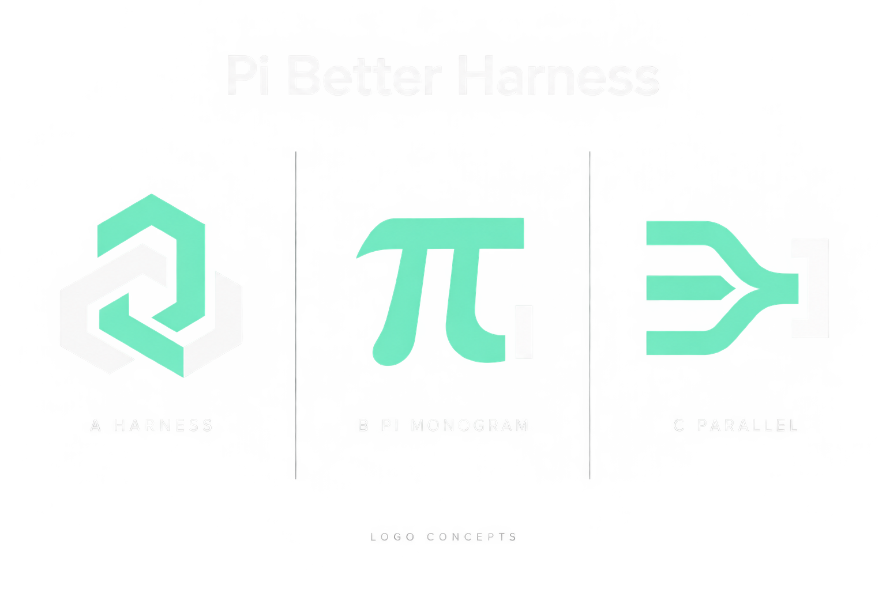

# Project Logo

The approved project mark is the refined pi-inspired monogram, with interlocking
mint and off-white bands and an integrated notch in the right leg.

`logo.png` is the 576x576 transparent, flat-color mark used in the root README
and all primary package gallery previews. It was extracted from the large
left-hand symbol in `pi-monogram-refined.png`, with the generated glow removed.
The refined presentation is retained as the approved source artwork.

## Earlier Concepts

`logo-concepts.png` is a generated comparison sheet for Pi Better Harness, not
an adopted logo. The three directions are:

- A: an interlocking geometric harness.
- B: a custom pi-inspired monogram.
- C: a parallel-work orchestration mark.

The palette follows the package gallery: mint, off-white, and charcoal. The
concept sheet is retained for reference; it does not replace any package's
`pi.image` preview.

