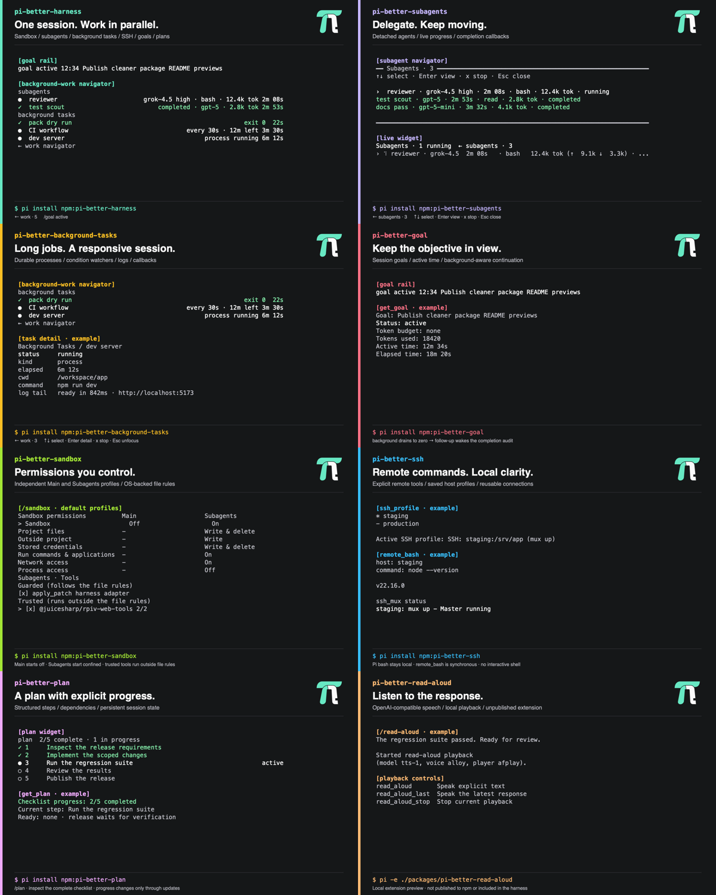

# Package Gallery Images

This folder keeps two package-gallery image styles:



Every primary preview includes the approved project monogram in its upper-right
corner, embedded from `../brand/logo.png` so the SVGs are self-contained.

- `./pi-better-*.png` and `./pi-better-*.svg` are the primary package images used by `package.json` `pi.image`. All eight extension packages have a deterministic 1200x750 preview, with a package-specific accent and larger text for gallery thumbnails. Harness, subagents, background tasks, goal, sandbox, and plan use actual feature render surfaces with demonstration state. SSH and read-aloud show labeled examples; generation does not connect to a host, call a speech provider, or play audio. These are previews, not live-session captures.
- `./overview/pi-better-*.png` and `./overview/pi-better-*.svg` are the earlier overview-card images. They are kept as alternate assets for docs, posts, or future package-gallery experiments.
- `./real-session/pi-better-harness.png`, `.svg`, and `.txt` are captured from a disposable real Pi TUI session with the goal, subagents, and background-task extensions loaded. The capture seeds durable extension state and uses a temporary probe extension only to read the live session id.

Run this from the repository root to regenerate only the primary actual-feature screenshots:

```sh
npm run gallery:render
```

The renderer uses macOS `sips` to rasterize SVGs into PNGs. Validate the existing
assets and every non-private extension's `pi.image` without regenerating them:

```sh
npm run gallery:check
```

The check rejects missing image metadata, missing previews, and PNGs with the
wrong format or dimensions. Rendering also fails if content exceeds the frame
instead of silently dropping rows. Private helper workspaces do not appear in
the gallery and do not need images.

## Gallery Rollout

The `pi-package` keyword makes an npm package discoverable on
[pi.dev/packages](https://pi.dev/packages); `pi.image` supplies its preview URL.
The gallery's [stylesheet](https://pi.dev/style.css) currently uses a 16:10
preview frame with cover cropping; the primary images match it to keep the
package names and install commands visible.
Push these assets to the repository's `main` branch so the public raw GitHub URLs
resolve. Release sandbox, SSH, and plan with their new `pi.image` metadata so the
gallery can read it from npm. The four packages with existing URLs reuse those
URLs and need no metadata change for this refresh; gallery or image caches may
delay the visible update.

Read-aloud now has a preview and image metadata ready for a future release, but
remains unpublished and lacks `pi-package`. This change does not publish it or
add it to the harness. Do not expect it in the public gallery yet.

Run this to recapture the real Pi TUI session screenshot:

```sh
npm run gallery:capture-real
```
